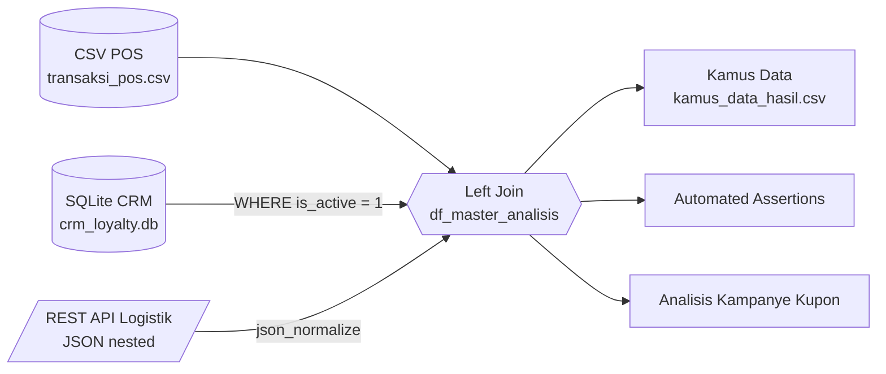

<div align="center">

# 🛒 Analisis Kampanye Kupon Diskon Akhir Bulan
### Multi-Source Data Wrangling Pipeline - PT Nusantara Retail Mandiri


**Tugas Mandiri Data Wrangling - Pertemuan 2**  
👤 Virgio Arwa Sandhika &nbsp;|&nbsp; 🎓 NIM 25200016

</div>

---

## 📌 Latar Belakang
Head of Business Strategy membutuhkan jawaban atas tiga pertanyaan terkait kampanye kupon diskon akhir bulan:

1. 🎟️ Berapa **total transaksi** yang menggunakan kupon?
2. 💎 Bagaimana **profil loyalitas pelanggan** yang memakainya?
3. 🚚 Apakah pesanan tersebut **sudah terkirim** oleh mitra logistik?

Masalahnya, data tersebar di **tiga sumber berbeda**, sehingga perlu diintegrasikan terlebih dahulu.

| Sumber | Departemen | Format | Teknologi yang Dipakai |
|---|---|---|---|
| Log transaksi | Kasir / POS | CSV | `pandas.read_csv` |
| Data pelanggan & membership | CRM | Database SQL | SQLite + `SQLAlchemy` |
| Status pengiriman | Mitra Ekspedisi | REST API (JSON nested) | `requests` + `pd.json_normalize` |

---

## 🧭 Alur Pipeline



---

## 🗂️ Struktur Repositori

```
.
├── Tugas1_DW_25200016.ipynb   # Notebook utama (Bagian A, B, C) + output
├── kamus_data_hasil.csv       # Kamus data otomatis
├── transaksi_pos.csv          # Dataset dummy: transaksi kasir
├── crm_loyalty.db             # Dataset dummy: database CRM (SQLite)
├── mock_logistik.json         # Dataset dummy: respons API logistik
├── requirements.txt           # Dependensi Python
└── README.md
```

---

## 📚 Isi Pengerjaan

### Bagian A - Analisis Konseptual & Tata Kelola Data
- Pemetaan **kebutuhan informasi bisnis → kebutuhan teknis data** (atribut, tipe data, sumber).
- **Matriks RACI** untuk Data Owner, Data Steward, Data Custodian/Engineer, dan Data User.

### Bagian B - Data Ingestion Pipeline
| Tahap | Detail |
|---|---|
| Ekstraksi CSV | `dtype={'order_id': str, 'customer_id': str}` dan `parse_dates=['order_date']` |
| Kueri SQL | SQLAlchemy ke SQLite, hanya pelanggan `is_active = 1` |
| Konsumsi API | `requests.get` + `pd.json_normalize()` untuk meratakan JSON nested, dengan fallback ke mock JSON |
| Integrasi | **Left join** dengan `validate=` untuk mencegah duplikasi baris |

> **Mengapa left join?** Tabel transaksi adalah *fact table*. Inner join akan membuang transaksi dari non-member/pelanggan nonaktif dan transaksi offline (tanpa pengiriman), sehingga total transaksi berkupon menjadi terlalu kecil.

### Bagian C - Metadata & Validasi
- **Kamus data otomatis**: nama kolom, dtype, jumlah & persentase missing value, jumlah nilai unik, sampel nilai.
- **Automated assertions**:
  - ✅ `order_id` (primary key) tidak duplikat
  - ✅ `total_amount` tidak negatif
  - ✅ Tidak ada tanggal pesanan di masa depan

---

## 📊 Ringkasan Hasil (Data Dummy)

| Pertanyaan | Temuan |
|---|---|
| 🎟️ Transaksi berkupon | **118 dari 250** transaksi (47,2%), total **Rp 35,22 juta** |
| 💎 Profil loyalitas | Didominasi **Bronze** (35 transaksi), diikuti Non-Member/Nonaktif (32), Silver (26), Gold (17), Platinum (8) |
| 🚚 Status pengiriman | **35 dari 64** pesanan online berkupon (54,7%) sudah terkirim |

> ℹ️ Angka di atas berasal dari **data dummy** yang dibangkitkan dengan seed tetap, bukan data perusahaan sebenarnya.

---

## 🚀 Cara Menjalankan

```bash
# 1. Clone repositori
git clone https://github.com/<username>/<nama-repo>.git
cd <nama-repo>

# 2. Install dependensi
pip install -r requirements.txt

# 3. Jalankan notebook
jupyter notebook Tugas1_DW_25200016.ipynb
```

Pilih **Run All** untuk menjalankan seluruh cell. Jika endpoint API tidak dapat diakses, notebook otomatis memakai `mock_logistik.json` sebagai fallback.

---

## 🔐 Catatan Tata Kelola Data
Kolom `customer_name` termasuk **data pribadi (PII)**. Pada kondisi nyata, akses terhadap kolom ini harus dibatasi sesuai peran pada matriks RACI.

---

<div align="center">

Dibuat oleh **Virgio Arwa Sandhika** (25200016)

</div>
